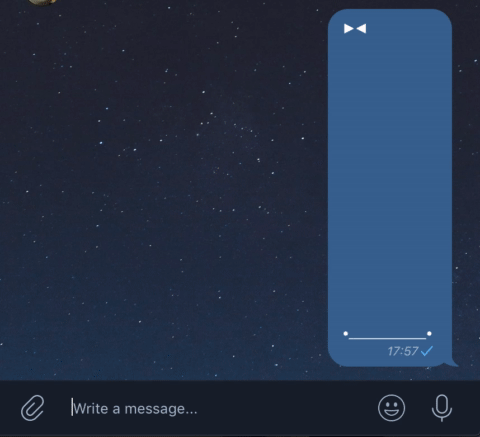

# reactor

Telegram bot that automatically add reaction buttons to messages (similar to slack/discord, but crappier).




## Features

- publish messages similar to [@like](https://t.me/like) but also allow to other users to add custom reactions
- repost chat messages on behalf of bot with added reaction buttons
- chat-wise settings:
  - list of predefined permanent buttons
  - types of messages to repost automatically
  - and more
- [magic marks](#magic-marks)


## Usage in groups

- add bot to the group
- give him admin rights (so it could delete messages)
- send message with media content -> bot will repost it with buttons
- reply to that message with "+button" to add new reaction
- use /help /settings /edit to monitor and control bot's behaviour


## Usage for channels

- go to private chat with bot
- type /create
- send message that you would like to "reactify"
- press "publish" -> pick channel -> pick message
- press "vote" to add new reaction -> user will be redirected to the private chat with bot -> send emoji/sticker to bot to add reaction


## Magic Marks

(group chats only)

Apply special action by adding prefix to message's text/caption.

```
# force bot to ignore message (if chat settings allow this type of message to be automatically reposted)
.-text

# force bot to repost message (if bot was told to ignore this type of message)
.+text

# force bot to repost message on his behalf
.++text
 
# hide credits (don't show who originally posted that message)
.~text

# show "👍 👎" buttons instead of default ones in that chat
.``text
.`👍 👎`text

# combine marks
.+~`👍 👎`text
```

Some magic marks also work with replies (if you are the original poster of that message)

```
# toggle credits
.~

# change buttons
.``
.`👍 👎`
```


## Deployment

### "Prod"

- Create `.envs/.production` dir and copy content of `.envs/.examples`
- Specify telegram bot token in `app.env`
- Run: `docker-compose -f docker-compose.yml up`

### Dev

- 1-2 from prod steps
- Create `.envs/.local` dir and copy content of `.envs/.examples`
- Adjust evn vars for local development
- Create `docker-compose.override.yml` and copy into it content of `docker-compose.override.example.yml`
- Run: `docker-compose up`
- Run migrations (in prod they run automatically after server start, but in dev it might be useful not to run migrations while you are still experimenting with them): 
    - `docker-compose exec bot python manage.py migrate`
- Misc:
    - `make start` - run bot
    - `make restart_bot` - restart bot container w/o waiting for threads to exit


## TODOs

#### features:

- [x] add basic bot functionality: messages reposting, reply reactions, chat default buttons
- [x] add reactions to albums without reposting each photo (simple reply with buttons)
- [x] show credits of original message: who posted, from whom forwarded
- [x] allow to change bot settings only to chat's admins
- [x] add more chat settings: 
  - [x] number of buttons in row
  - [x] types of messages to be reposted
  - [x] buttons padding
  - [x] hide/show credits
  - [x] reply to the original message instead of reposting it
  - [x] allow to disable reactions
  - [x] add emoji enforcing
  - [ ] max number of buttons to show
- [x] add forced processing/anonymity/ignore/custom buttons via magic marks (text/caption prefixes)
- [x] reactions for channels via inline interface
- [x] add setting for inline posting
- [ ] gather and store chat statistics
- [ ] add web UI for chat administration and statistics

#### misc:

- add Post model that bind to buttons, several Messages could point to the post. This will allow to add reaction for one post from multiple chats/channels
- keep adding new buttons but show only the most popular
- refactor this mess
- add clean up cronjob (remove old messages>buttons>reactions)
- add automatic backups
- add some tests
- add CI
- apply reactions in bulk on high load
